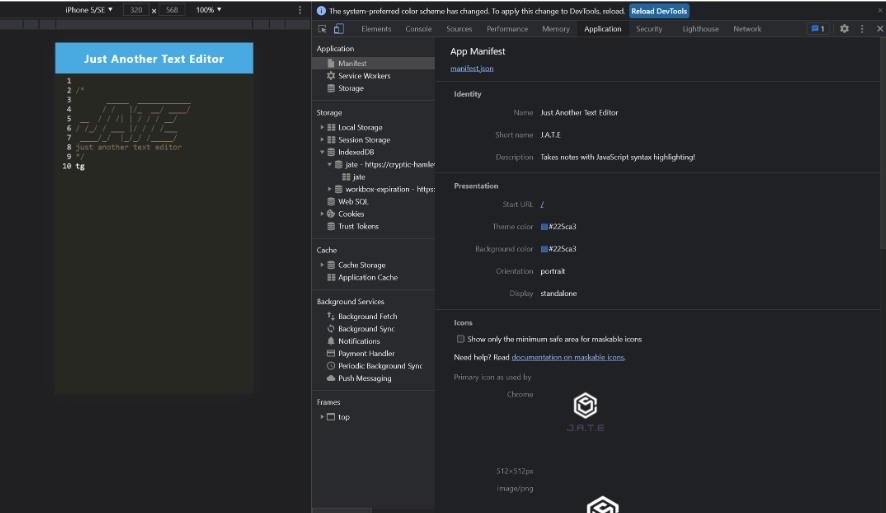

# text-editor
  by allstarcoding777
  
  * ## Description
  This is a single-page application that works as a text-editor in the browser.
  * ## Usage
  Open code in terminal. Type npm run start.
  
  
  
  * ## Github Repository
  https://github.com/allstarcoding777/text-editor
  * ## License
  This project is licensed under the MIT license.